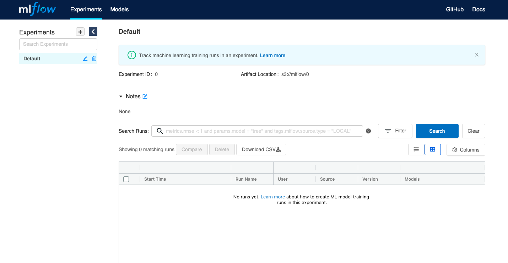
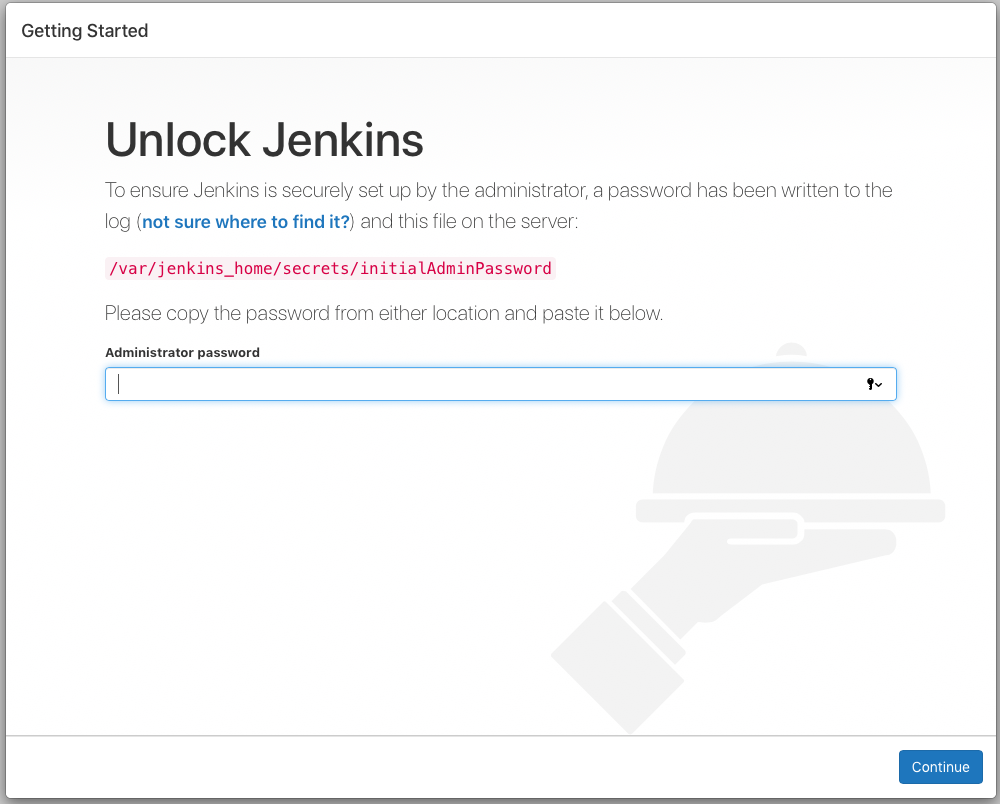
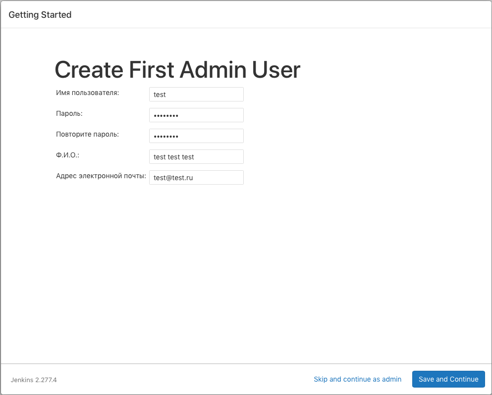
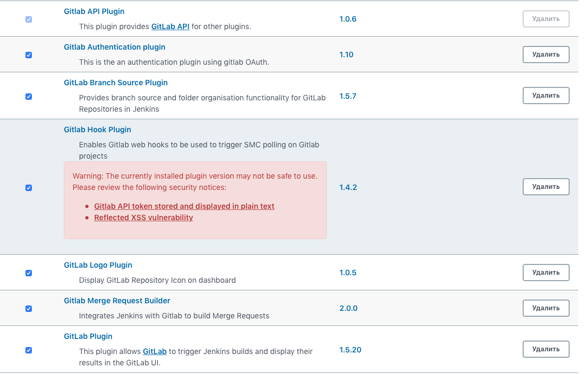
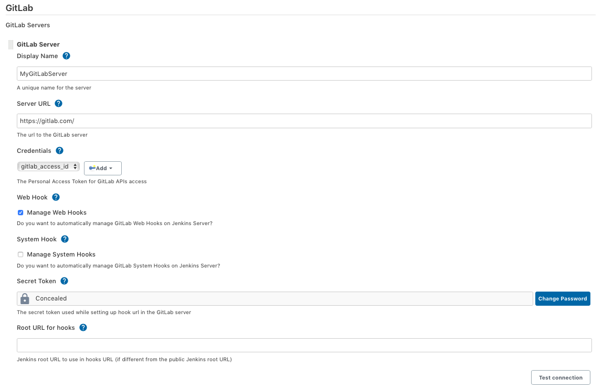
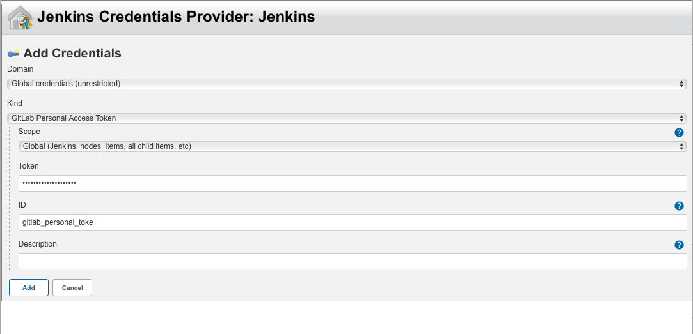
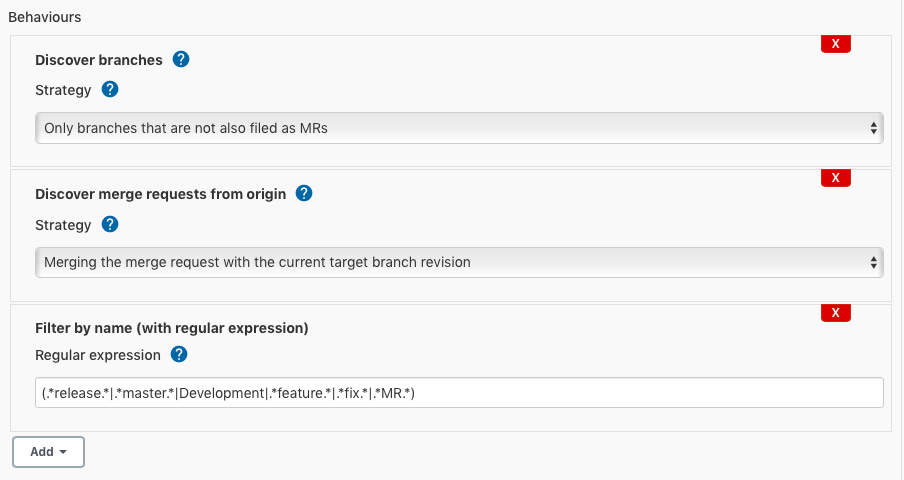

# MLops

This repository is a step by step tutorial on deploying multiple MLops tools:

- Jenkins
- MLflow
- Minio

***Note: for testing this MLops setup, you can use [this repository](https://github.com/ChesnovAE/simple_ml_model)***

If this manual helped you, then please put a star :)

## Table of contents

- [Prerequisites](#prerequisites)
- [Installation](#installation)
- [MLflow](#mlflow)
- [First Jenkins setup](#first-jenkins-setup)
- [Jenkins GitLab Server setup](#jenkins-gitlab-server-setup)
- [Jenkins multibranch pipeline](#jenkins-multibranch-pipeline)
- [Git hooks](#git-hooks)
- [ToDo list](#todo-list)

## Prerequisites

- docker ([install](https://docs.docker.com/engine/install/))
- docker-compose ([install](https://docs.docker.com/compose/install/))
- conda [Optional] ([install](https://docs.anaconda.com/anaconda/install/) you need CLI version)

## Installation

1. Create ```.env``` file at the root of the project and pass this variables

```bash
MINIO_ACCESS_KEY=root
MINIO_SECRET_KEY=toortoor
AWS_ACCESS_KEY_ID=root
AWS_SECRET_ACCESS_KEY=toortoor
MLFLOW_S3_ENDPOINT_URL=http://localhost:9000
POSTGRES_USER=root
POSTGRES_PASSWORD=toor
```

2. Create mlflow bucket for s3 (minio) storage

```bash
mkdir -p ./buckets/mlflow
```

3. Up containers via ```docker-compose```

```bash
docker-compose --env-file ./.env up -d
```

You should see something like this in your terminal:

```bash
Starting s3                         ... done
Starting jenkins                  ... done
Starting postgresql ... done
Starting mlops_pipeline_waitfordb_1 ... done
Starting mlflow_server              ... done
```

***Note: Jenkins setup can take some minutes. Just Wait***

To stop all containers, run

```bash
docker-compose stop
```

4. Install python packages for mlflow
    - use only python3-pip:

        ```bash
        pip3 install -r requirements.txt
        ```

    - use conda

        ```bash
        conda create -n mlflow_env python=3.8
        ```

        ```bash
        conda activate mlflow_env
        ```

        ```bash
        conda install --file requirements.txt
        ```

## MLflow

After all the containers are started, you can enter ```http://localhost:5000``` in your browser and you should see something like this


Then you can run

```bash
python3 train_example.py
```

and see experiment in MLflow UI

## First Jenkins setup

- Go to ```https://localhost:8081```. You should see this window

- Go to terminal and enter this command:

```bash
docker-compose logs jenkins
```

- Find this block in logs and copy the key and paste it to Jenkins window:

```bash
jenkins      | *************************************************************
jenkins      | *************************************************************
jenkins      | *************************************************************
jenkins      | 
jenkins      | Jenkins initial setup is required. An admin user has been created and a password generated.
jenkins      | Please use the following password to proceed to installation:
jenkins      | 
jenkins      | c0cd2e7c8a5d48b7b0d336c544ce6caa
jenkins      | 
jenkins      | This may also be found at: /var/jenkins_home/secrets/initialAdminPassword
jenkins      | 
jenkins      | *************************************************************
jenkins      | *************************************************************
jenkins      | *************************************************************
```

- In the next window choose ```Select plugins to install``` and:
  - choose all plugins in ```Pipelines and Continuous Delivery``` section
  - choose ```Git parameter, GitHub, GitLab``` in ```Source Code Management``` section

- click install button and wait some minutes

- create admin user


- follow finish steps and start using Jenkins

## Jenkins GitLab Server setup

1. Well... Fist of all you need to install some gitlab plugins

    - Go to ```Manage Jenkins (Настроить Jenkins)``` and then go to ```Manage Plugins (Управление плагинами)```

    - Go to ```available```  and install follow plugins
    

    - Click ```Download and install after restart``` and then add checkbox ```restart after install (перезапустить Jenkins по окончанию ...)```

    - Wait for Jenkins restart

2. Next you need to configure GitLab Server in Jenkins
    - You need to create and **copy or save token!** your personal access token (see [this tutorial](https://docs.gitlab.com/ee/user/profile/personal_access_tokens.html)). ***Note: in scopes section choose ```api, read_user, read_repository```.***

    - Go to ```Manage Jenkins (Настроить Jenkins)``` and then go to ```Configure system (Конфигурация системы)```

    - Find section ```GitLab```, click ```Add GitLab Server``` button and fill the form
    .

    - In credentials section click ```Add, Jenkins```, choose ```GitLab Personal Access Token``` , paste copied token and click ```Add``` button
    

    - Clik ```Test connection``` button. You should see: ```Credentials verified for user <your_gitlab_username>```

## Jenkins multibranch pipeline

- Click ```New Item (Создать Item)``` and choose **Multibranch Pipeline** and click ```OK```.

- Now you need to configure the project

  - In ```Branch Sources``` section click ```Add source -> GitLab project```. Choose your gitlab server and enter gitlab username in field ```Owner```
  

  - Now you can choose your gitlab project in scope ```Projects```

  - In ```Behaviours``` section you can configure branches and MR's behaviour. For example: filter branches by reqular expression (build only passed branches)
  

  - In the end configure scan repository triggers. You can choose scan period
  

  - Click ```Save```.

After saving Jenkins will start scanning your repository and search for Jenkinsfile (read [this](https://www.jenkins.io/doc/book/pipeline/jenkinsfile/) about Jenkinsfile and [this](https://www.jenkins.io/doc/book/pipeline/syntax/) about Pipeline Sytax. ***Also you can check Jenkinsfile example [there](./examples/_jenkins/Jenkinsfile) from [this](https://github.com/ChesnovAE/simple_ml_model) simple project***).

Now Jenkins will automatically check the repository for changes and follow the instructions written in Jenkinsfile.

## Git hooks

- For using git hooks you need to init your git repository with command

```bash
git init --template git_template
```

where ```git_template``` is template dir with hooks

## ToDo list

- [x] ~~Add MLflow example~~
- [x] ~~Add jenkins setups~~
- [x] ~~Add git hook template large files~~
- [ ] Add jenkins automatically pull trained models
- [ ] Add linter hook template
- [ ] Add minio notification setup
